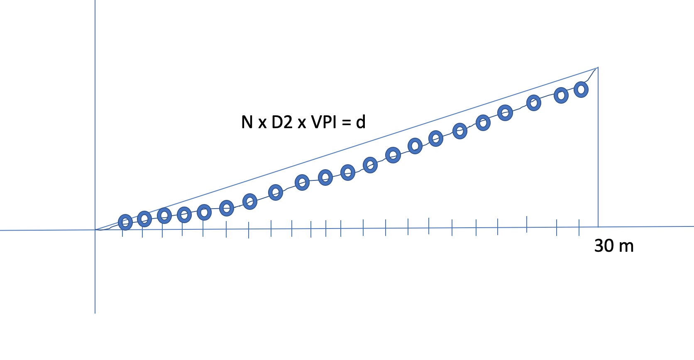
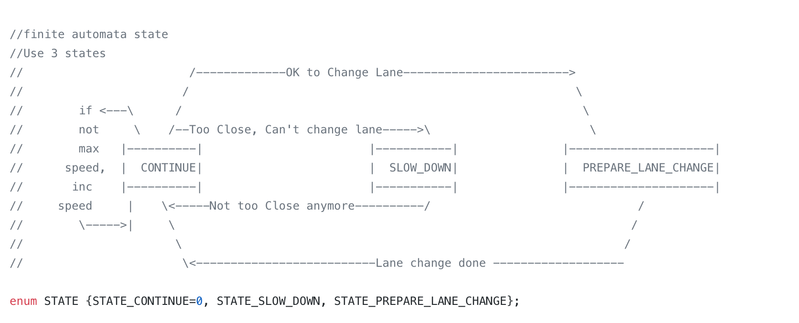

# CarND-Path-Planning-Project
Self-Driving Car Engineer Nanodegree Program

## Model Documentation
In the path planning, the trajectory of the vehicle is generated from historical path, if available, and then creating a path in front of the vehicle.

If less than 2 previous points are available, first, calculate previous point from the current car position using the path tangent to the car.

```			 
	//use two points that make the path tangent to the car
	
   double prev_car_x = car_x - cos(car_yaw);
   double prev_car_y = car_y - sin(car_yaw); 
```

If more points are available, use the last and 2nd last point to generate the path tangent.
                   

```
	//last point
	ref_x = previous_path_x[prev_size -1];
	ref_y = previous_path_y[prev_size -1];

	//2nd to the last point
   double ref_x_prev = previous_path_x[prev_size - 2];
   double ref_y_prev = previous_path_y[prev_size - 2];
                        
```

Then, using Frenet, add evenly spaced points ahead of the car to cover 30 m distance. 

```
//In Frenet add evenly 30m spaced points ahead of the starting ref
vector<double> next_wp0 = getXY(car_s+30, (2+4*lane), map_waypoints_s, map_waypoints_x, map_waypoints_y);
vector<double> next_wp1 = getXY(car_s+60, (2+4*lane), map_waypoints_s, map_waypoints_x, map_waypoints_y);
vector<double> next_wp2 = getXY(car_s+90, (2+4*lane), map_waypoints_s, map_waypoints_x, map_waypoints_y);
```

These points are given to spline to generate points.

```
 //create a spline
 tk::spline s;

 //set (x,y) point to the spline
 s.set_points(ptsx, ptsy);
```
 
Now, to generate the path, first, identify how many points (N) are needed to maintain the target speed. The new points are generated in new space with reference angle 0 degree to use spline. 30 m distance is divided in total points of 50. In the new reference coordinate, x point is generated evenly spaced based on target distance and N. y-points are generated using spline. Then, the new points are shifted back to original reference coordinate.

```
	double N = (target_dist/(0.02 * ref_val/2.24));
	double x_point = x_add_on + (target_x)/N;
	double y_point = s(x_point);

   x_add_on = x_point;

   double x_ref = x_point;
   double y_ref = y_point;

   //rotate back to normal 
   x_point = x_ref * cos(ref_yaw) - y_ref * sin(ref_yaw);
   y_point = x_ref * sin(ref_yaw) + y_ref * cos(ref_yaw);

   x_point  += ref_x;
   y_point  += ref_y;
```

A pictorial diagram is shown below:



The above figure shows x points in the new coordinate and estimated and fed to the spline, which calculates the y points. New reference point with reference angle 0 degree makes it easier to calculate these points. Later, the points are shifted back to the orginal coordinate system.

Once the path is generated, the car follows the path. The spacing of the points determines using the targeted speed calcuated from reference value (ref_val). 

I have used a state machine to determine whether the car should stay on the lane, change lane if possible when there is a car infront of it, and speed up or slow down depending on the situation. The car speeds up to match the targeted velocity (which is close the speed limit) and the car slows down when there is a car in front of it and it can't safely change lane.

The state machine is shown as below:

